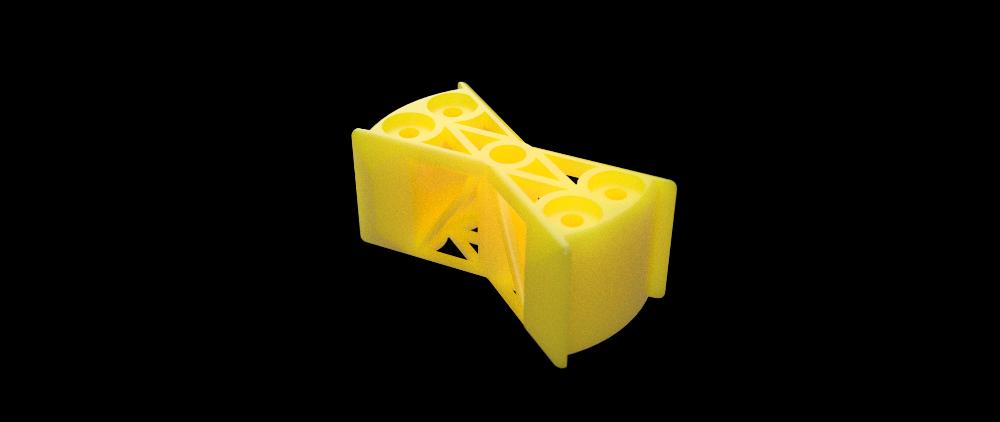

# Lorentz force DC motor

![The motor has two yellow 3D-printed magnet holders. Magnet wire is wound
around a 3D-printed rotor. The axle is a wooden dowel stick, and his held up by
two 3D-printed holders, one of which is black instead of yellow. The holders
are screwed into a poorly cut piece of hardboard, with some text on it written
in markers (used during the assessment). Paperclips are used as brushes and are
screwed in and their angles are retained using masking tape. There is also
masking tape wrapped around the axle at two points.](dc-motor-2.jpg)

This is a DC motor I built for EIR 221 at the University of Pretoria. We were
limited to a R200 budget ($10) and had to build it during a one-week recess.

I got it working in two days, providing me with some spare time during the
recess.

[Watch a video of the early prototype](#video)

## Operating principle

Unlike most DC motor projects, which use an alternating electromagnet to push
the rotor away from the magnets, this motor uses the Lorentz force, which is
the force experienced by a copper wire near a magnet while current flows
through the wire.

Because there are 100 windings, this force is multiplied by 100, which gives
the rotor enough momentum from standstill to turn 180 degrees, allowing the
wire at the opposite end to get near the magnet.

At that point, the Lorentz force would be operating in the opposite direction,
slowing the motor down, except that the commutator (the metal on the axle that
is touching the paperclips) is flipped around, which flips the direction of the
electrical current and therefore the Lorentz force.

## Brushes

The brushes are just paperclips that were bent into shape. Their purpose is to
provide a stationary electrical connection to the spinning rotor.

At the end of the project, they were held in place with masking tape.

## Rotor design

All 3D-printed parts were designed in Autodesk Fusion.

### First iteration

The first iteration of the rotor was a failure, as there was only enough room
for about 20-30 windings. This was not enough windings to provide enough
resistance to the battery, causing the voltage to drop under the massive
current draw. In more technical terms, the rotor was poorly impedance-matched
with the battery.

The surface that the windings lay on was also flat instead of curved, so the
diagonal length of the rotor was longer than its longitudinal length, which
meant that the windings would only get close to the magnets in four positions.

### Second iteration

In the second iteration, in order to increase the rotational inertia, material
was added to the outside and holes were added for nails, which also served to
focus the magnetic fields from the magnets toward the windings (at least in
theory).

The windings were also designed to follow a curved contour, keeping them close
to the magnets.

More room was added for 100 windings, which still ended up being too few for
the lab's bench power supply, but which was enough for fully-charged 9V
batteries.

## Commutator

The commutator is just a few sanded-down pieces of magnet wire soldered to the
magnet wire coming from the rotor.

Soldering this wire was tricky, as the thick magnet wire conducted most of the
heat away from the 48W soldering iron.

Some masking tape and Kapton tape was later added to keep the commutator fixed
and prevent the axle from moving laterally.

## Speed sensor

The assignment required an additional commutator to act as a speed sensor. This
commutator is made of two nails with some wire wrapped around them to connect
them electrically. The brushes (paperclips) are electrically connected twice
per revolution, allowing for speed measurement via an oscilloscope.

## Video

Here is a an early version of the motor connected to a 9V battery. To get a
sense of the speed, turn on the sound.

import ReactPlayer from 'react-player'
import earlySpinning from './early-spinning.mp4';

<ReactPlayer controls url={earlySpinning} />

## What should have been done differently

The rotor should have been designed to allow for even more windings with a
greater arc length.

More time should have been spent while making the commutator in order to
increase the duration of contact made with the brushes.
